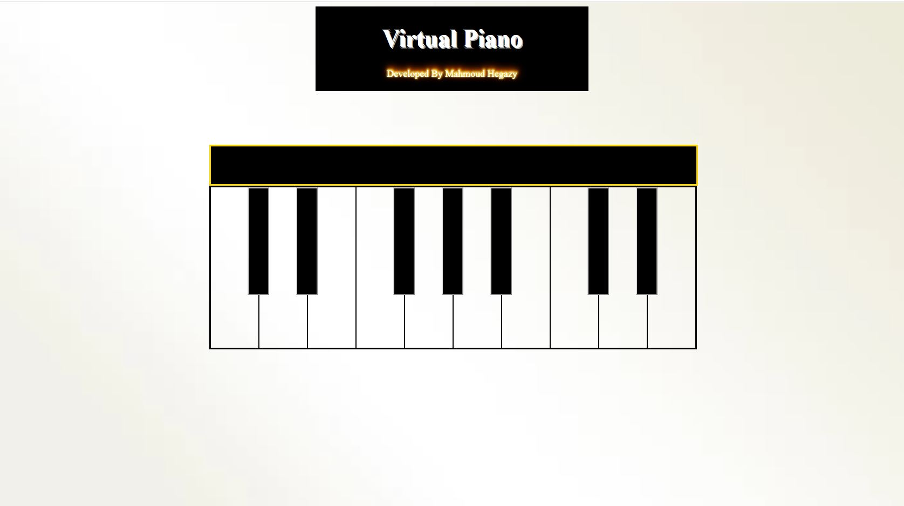

# Virtual-Piano
Online Piano Simple and Easy.
  

## App langagues: 
1. HTML5
2. Javascript
3. CSS 

## about:
I used HTML5 audio and javascript to make key sounds

## How to Use It:
You can play music using mouse or keyboard
 [S, D, F, G, H, K, L, ;]
 
## Last Update
1. added event onmousedown and onmouseup to control hover
2. added function to play the sound with more  flexibility 
3. created to modes one for learning(slow) and second for play normal(fast)
4. added folder base contains piano sounds with the right order (c3-e4)

 
# screen shot

